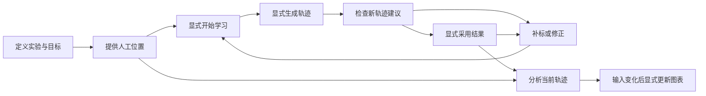

# Phase 5.7 — Interaction Architecture Redesign

> 状态：**Proposed / 待用户批准；不是实施授权，也不是已接受 ADR。**
> 日期：2026-09-16；角色：Product Interaction Architecture Reviewer。
> 初始研究基线：`main @ daad086`；收尾增量核对：`main @ d606bb4`（已合并 Pre-Phase 6 Stabilization 及 latest-train tie-break 修复）。本轮为仓库静态研究与产品设计，未运行新 GUI Human Review、DLC 实验或产品测试。
> 交付对象：后续 Sol / implementation Agent。只设计信息架构、交互、推荐职责与验收；不修改产品代码、数据格式、数值算法或既有验收结果。

## 1. Executive Product Diagnosis

**AI Physics Tracker 应围绕“建立并检查一条实验轨迹”组织，而不是围绕“操作一组 AI 任务”组织。建议取消当前常驻的 AI Tasks 控件总表，以三个工作区和一个上下文任务卡替代。**

三个工作区是 **实验设置 → 获取轨迹 → 分析与图表**。它们是可返回的工作位置，不是必须依次完成的向导。AI 的标注、训练、跟踪、检查和优化都发生在“获取轨迹”内部；手工轨迹可以直接进入分析。

核心产品改变：

- 每个上下文始终显示“正在做什么／下一步／分析条件”，而非让用户从按钮使能状态推断流程。
- 系统承担技术方案选择；用户决定是否投入计算、如何标注、是否采用结果，以及如何解释实验。
- “生成了新结果”与“当前分析正在使用的轨迹”以日常语言持续区分；查看候选不切换分析来源。
- “可进入分析”表示满足指定范围和物理量的计算条件，不是 AI 准确性认证。
- 停止优化是正常出口。没有发现困难帧、没有明显改善或缺乏可比证据，都要产生具体结论，不能把用户送回参数表。

对 [interaction-experience.md](../notes/interaction-experience.md) 的裁定：接受其问题陈述、系统默认和信息分层方向；**不采用“标注→训练→检查→完成”的全局阶段条**。它把训练误当作用户目标，把分析藏在“完成”之后，也无法表达“旧轨迹仍可分析、新候选尚待检查”的并行事实。不采用“检查完且指标稳定＝模型够用”；不采用“没有困难帧＝整段准确”；不把全部历史、检查依据和控制项塞进同一个“高级”折叠区。

## 2. Target User Mental Model

研究者／教师应该只需要理解五件事：

1. **实验范围**：我要研究哪段视频、哪个物体、什么坐标和单位。
2. **人工示例**：我指出物体在少量画面中的位置，软件据此学习。
3. **轨迹建议**：软件给出的全视频位置需要检查，尚不是人工测量真值。
4. **当前采用轨迹**：我选择用于分析的 AI 结果，加上始终优先的人工位置。
5. **分析结果**：图表由当前轨迹、标定、时间和计算设置得到；这些输入变化后需要更新。

不要求用户建立 train run → snapshot → infer run → active pointer 的对象模型。需要追溯时仍可沿“本次轨迹来自哪里”查看这条完整链路。

产品语言示例（中文为语义规范，后续可沿用应用现有英文语言）：

| 内部术语 | Normal Mode 中的表达 | 不能暗示的含义 |
| --- | --- | --- |
| Train | 学习示例位置；按钮“开始学习” | 学完就已有整段轨迹 |
| Infer | 跟踪整段视频；按钮“生成轨迹” | 生成即采用 |
| Candidate | 新轨迹建议 · 尚未采用 | 当前图表已使用它 |
| Active result | 当前采用的 AI 结果 | 包含所有人工点的独立模型产物 |
| Correct | 手工修正位置 | 只是编辑一幅预览图 |
| Accept | 位置可接受 | 把预测转成人工训练标签 |
| Skip | 跳过此帧 | 已确认正确、已删除预测、已排除分析 |
| Validation series | 固定检查帧 | 独立于所有模型选择的最终测试集 |
| Mining | 查找需要检查的画面 | 证明其余画面全部正确 |
| Derived stale | 轨迹或设置已变化，请更新图表 | 原始数据已损坏 |

“训练（training）”“推理（inference）”可在证据说明中对应技术名，帮助高级用户，但不作为主导航名称。

## 3. Current Interaction Failure Analysis

下表的 GUI 诊断基于初始研究基线；收尾时主要布局仍沿用该结构，Advisor 事实采集已移入 `application/advisor_collection.py`，修复状态见 §15。下表区分直接观察与产品推断。历史 Human Review 证明局部操作可用，不等于初学者可以独立理解整个流程。

| 当前事实及定位 | 对三个核心问题的影响 | 设计回应 |
| --- | --- | --- |
| [TaskPanel](../../src/ai_physics_tracker/gui/task_panel.py) 的 `__init__` 同屏构造建议帧、训练表单、模型列表、挖掘、审核、激活、历史和日志；三列并置 | 用户不知道哪个动作是当前步骤，参数和结果争夺注意力 | 一个当前任务卡；证据、历史按目的分别进入 |
| [MainWindow](../../src/ai_physics_tracker/gui/main_window.py) 初始化时抬起 Charts；[TrackingActions](../../src/ai_physics_tracker/gui/tracking_actions.py) 将 AI dock 与 Charts tabify | 获取轨迹和使用轨迹是相邻工具页，没有交接说明；AI 面板可能最初不可见 | 常驻工作区导航和分析条件摘要 |
| `TrackingActions.train/infer` 从模式、模型选中项采集执行参数 | 用户必须先推断模型关系，才敢按按钮 | 推荐已绑定的执行计划；参数只读摘要先于高级编辑 |
| `TaskPanel.setAdvisorSummary` 仍显示 action 枚举；Apply 只填参数 | “有建议”没有转换成“我现在能做什么” | 推荐输出直接映射用户意图；保留现有只填表入口作兼容 |
| `activateRun/replaceRun` 在历史选择后弹出 run ID 确认 | 推理完成和轨迹可用之间出现隐形步骤 | 新结果卡直接给出“采用此轨迹”及影响预览 |
| `DifficultFrameReviewActions` 绑定所选 infer run；Correct 写入 canonical manual | 用户可能以为检查的是当前轨迹，或误以为修正候选不影响现用轨迹 | 视频角标明确结果；修正处注明“修改该目标的人工位置，会更新当前轨迹” |
| `_finish_success` 空候选文案声称 every frame confident and consistent | 将筛查未命中放大为全段可靠性；排除帧和已审核帧也可能造成空结果 | 按空结果原因作有限结论，保留范围和排除数量 |
| [ChartActions](../../src/ai_physics_tracker/gui/chart_actions.py) 显式 `recompute`；参数变化与输入代际都有独立语义 | 用户不知道采用后为何图没变，或把旧图误认成新结果 | “待更新”状态、指定来源、明确更新按钮 |
| Phase 5.6 实验增加标签／重训并不持续改善，最终 ≥5% 改善未达成 | “再训练一次”不能充当默认出口 | 先判断是否有值得处理的问题；保留旧结果并结束无收益循环 |

证据来源：[Pre-Phase 6 evidence package](../reviews/pre-phase6-evidence-package.md) §3/§8/§9、[Phase 5 spec](../spec/phase5-requirements.md)、[5.1 review](../reviews/phase-5.1-review.md)、[5.3 review](../reviews/phase-5.3-review.md)、[5.4 review](../reviews/phase-5.4-review.md)、[5.5 HR](../reviews/phase-5.5-review.md)、[5.6 review](../reviews/phase-5.6-review.md)。用户真实困惑来自体验记录；本报告的方案效果尚待验证。

## 4. Product Principles

1. **目标优先于技术过程**：进入分析不以完成 AI 流程为前提。
2. **一个推荐，允许合理旁路**：主按钮表示推荐下一步；旧轨迹可用时保留“查看当前分析”，不强迫优化。
3. **显式执行、自动判断**：系统准备方案，用户触发动作；查看页面、展开证据、选择历史都不启动 AI 或改分析来源。
4. **结论必须有边界**：参数、覆盖率、置信度、审核进度和固定检查误差各有含义，不合成不透明“质量分”。
5. **来源处处可见**：视频、目标、范围、当前采用结果和候选结果不会依赖隐藏选中项。
6. **人工数据不是模型附件**：换结果仍保留人工点；检查候选时的人工修正也会影响同目标当前轨迹。
7. **不把操作完成伪装成科学完成**：队列处理完、任务完成、图表最新分别显示。
8. **保留有限、可解释的技术控制**：采用现有参数能力，不新增自动 HPO 或无限训练调度器。

## 5. Normal vs Advanced Responsibilities

### 5.1 What should the user NEVER have to decide in Normal Mode?

“无需决定”指完成普通路径不需要技术选择，不是剥夺查看或覆盖权。

| 项目 | 系统在 Normal Mode 的职责 | Evidence / Advanced |
| --- | --- | --- |
| train run | 自动绑定当前动作所需的、属于本目标的合格来源 | 证据用“第 2 次学习”；历史中可查 UUID、父轮及数据快照 |
| infer run | 正常检查绑定新候选；分析始终绑定当前采用结果；禁止从历史列表选中项隐式推断 | 高级历史可切换预览对象；采用须另点按钮 |
| snapshot | 使用所选 completed train run 已记录且可用的 snapshot，不列磁盘文件让用户猜 | 显示来源；不新增任意 snapshot 搜索能力 |
| validation series | 建议固定检查帧成员并复用有效集合，不要求用户识别 series ID | 普通用户确认用途和帧预览；高级可编辑成员／名称 |
| active pointer | 用户选择“采用此轨迹”，系统执行 activate 或 replace | 历史显示采用记录；不暴露指针编辑器 |
| restart/resume | 按兼容性、验证资格、新标签与近期证据给出单一建议 | 摘要“在上次基础上继续／从头学习”；高级可改，执行入口仍校验 |
| confidence threshold | 沿用已采用结果的阈值；首次沿用当前默认 0.60。无独立依据不自动调高以美化结果 | 显示“低把握预测保留在检查依据中，部分不进入轨迹”；高级修改仅作用下一次生成 |
| batch size | 沿用最近成功配置；首次当前默认 8；明确 OOM 才建议减半，最低 1 | 摘要显示 batch；无硬件依据不自动增大 |
| epochs | 首次当前默认 50；追加优先现有 Advisor 有限档 25／50 | 显示“本次追加 25 epochs”；epoch 数不是预计分钟 |
| model selection / comparison | 用合格固定检查证据给结论；证据不足就保留现用结果，不用最新／高置信冒充最佳 | 比较详情见 §12；高级可有理由地采用非推荐结果 |
| representative strategy/count | 默认 K-means，第一批至多 10 个未标注代表帧；不足按实际数；补标以有界小批建议 | 说明时间范围、多样性目的；高级保留 Uniform、数量、现有参数 |
| difficult-frame count/gap | 初始沿用 Top N=10、min gap=0.25s；上限不是必须填满；返回实际数 | 显示实际候选／排除／间隔放宽；高级保留现有控件 |
| device | 默认 auto，显示实际解析设备；不可用设备不悄悄当作已启用 | 高级选择 CPU/MPS/CUDA，错误给具体修复动作 |

以上数字是**保守初版产品默认提案**，来自当前控件／Advisor，不是证明适合所有视频的实验结论；不得把“10 帧完成”写成“训练充分”。该设计不要求普通用户回答这些数值问题，也不承诺系统会找到最优参数。

### 5.2 What MUST remain an explicit user decision?

| 用户决定 | 最小明确操作 | 为何保留 |
| --- | --- | --- |
| 研究对象、范围、尺度、坐标及必要的近似时间授权 | 实验设置；必要时“使用近似时间” | 决定实验问题和单位，系统不能猜测科学意图 |
| 是否使用 AI、是否开始耗时学习／全视频跟踪／筛查 | “开始学习”“生成轨迹”“检查这条轨迹” | 显式启动实际工作；按钮前列明范围与计算内容 |
| 固定检查帧的冻结／重新建立 | 查看系统预选帧后“保留这些检查帧” | 有限人工标签将退出训练；改变集合会终止直接跨轮比较 |
| 接受画面中的预测、修正人工位置或跳过 | 逐帧操作，Correct 需在视频落点 | 只有人提供人工标签；跳过不是质量背书 |
| 采用／替换／移除 AI 结果 | “采用此轨迹”及其内联影响确认；移除位于结果管理 | 决定分析输入，不能由推荐静默执行 |
| 删除人工点、删除对象／数据 | 独立操作并说明恢复边界 | 人工数据改变，不应混在“跳过”或“重试”里 |
| 是否继续优化 | “继续优化” | 每一轮都有时间和人工成本，收益不保证 |
| 重算物理量 | “计算图表”／“更新图表” | 保留显式 Recompute；用户知道何时改变派生结果 |

**进入分析页本身不是审批，不增加“最终分析确认”弹窗。** 用户可以随时查看已有图表、探索可用区段。若数据不足，页面给出具体条件；若仍有待检查帧，入口写“查看分析（还有 N 帧待检查）”，不能显示无条件“已就绪”。保存、导航和展开高级设置也不增加额外确认。

### 5.3 三层信息，两个独立入口

- **Action**：当前步骤、下一步理由、一项主动作、分析可用性。
- **Evidence**：“依据与本次设置”就地展开；非高级用户也能理解。包括标签数、检查范围、误差比较、限制、计划参数、采用影响。
- **Advanced Control**：“调整本次设置”只显示当前动作可调项，修改后摘要变为“使用自定义设置”，可恢复推荐。高级覆盖不能绕过任务归属、固定验证、产物或时间门禁。

“结果与历史”是独立的稳定入口，不藏在参数折叠内。普通用户可看可读摘要，高级详情才呈现 run、snapshot、日志和 lineage。

## 6. Proposed User Journey

### 6.1 创建／打开项目 → 实验设置

新建／打开后显示项目、视频和目标选择。未载入视频时主动作“添加实验视频”；旧项目直接恢复真实数据状态，不根据曾经点过的步骤判定进度。定义分析范围、创建目标、必要时授权时间。标定可先做，也可在轨迹之后完成；无标定时明确只能用像素量，不阻塞人工标注和轨迹检查。

没有目标时提示“请选择要跟踪的物体”；不是先弹 DLC 配置。创建目标后的“获取轨迹”卡给出“逐帧标记”与推荐的“用少量示例自动跟踪”。已有手工轨迹仍可直接分析，不必训练。

### 6.2 AI 第一次出现 → 初始标注

点击“用少量示例自动跟踪”显示短说明：“先在少量画面中指出物体位置，再生成整段轨迹供你检查。”按钮“挑选代表画面”显式启动选帧。

默认建议至多 10 帧。视频旁显示“本批已标 4/10；项目已有人工位置 7 帧”，两种计数不混用。单击缩略项或“下一帧”即可导航，不依赖发现双击。定位成功后才显示可标注状态；解码中的跳帧不能落点。用户可跳过无法判断的初始画面，继续补足可用示例；该导航跳过不冒充 run-scoped review 的 Skip，也不创建标签。

少于 3 个可训练人工帧时，主动作始终是补标。达到接口最低数仅表示“可以开始尝试”；建议完成分布更广的首批，允许用户提前开始且说明“检查依据有限”。标注目标数不是算法准确性门槛。

### 6.3 固定检查帧 → 学习示例位置

首次训练前给出“留出一些人工位置，用同一把尺子比较后续结果”。对于至少 4 个标签，建议从按帧号排序的人工点中选取跨时间分布的检查帧：数量 `min(n−3, max(1, floor(0.2*n)))`，用确定的等间隔位置取成员（去重，平局取较早帧）。例如 10 帧预选 2 帧检查、8 帧训练。此为待批准初版选择规则，不能声称覆盖了所有运动形态。

预览展示所选帧和位置，用户点“保留这些检查帧”才冻结；可以换成员。已有有效集合直接复用。仅 3 帧时推荐补标，次要入口允许“先尝试学习（无法可靠比较改善）”；沿用当前无 fixed validation 的能力，不创建虚假基准。

主卡：“可以开始学习；使用 8 帧人工示例，另 2 帧用于检查。50 epochs · Batch 8 · 自动设备。”点击“开始学习”，只启动这一轮训练和既有评价，不自动串联推理、筛查或激活。

### 6.4 学习完成 → 生成轨迹

学习是“获取轨迹”的一个计算子步骤，不是全局阶段。完成后：“已学完示例位置。下一步把它应用到这段视频。”主按钮“生成轨迹”，范围与模型来源已填好；没有模型列表决策。训练评价失败但有可用模型时明确“模型已生成，比较依据未生成”，允许受限跟踪，不谎称整个训练毫无产出。

**训练与推理保留两个显式动作，但不分成两个顶级阶段。** 原因是成本、失败和恢复点不同，现有契约要求明确启动。一次完成后系统准备下一个建议，用户不必懂技术衔接。5.7 不引入跨任务自动流水线；如将来合并成“学习并生成轨迹”，需要另行定义有限链路授权、取消及恢复，而不是隐藏自动执行。

### 6.5 新轨迹 → 检查 → 采用

生成完成后显示“新轨迹建议，尚未用于分析”。视频切到明确标识的候选预览；当前已采用结果名称一直保留。主动作“检查这条轨迹”显式筛查并建立审核队列。

检查时视频保持主要空间。候选原因翻译为“预测把握较低”“位置变化异常”“偏离附近运动趋势”“邻近先前修正处”“没有预测位置”；可展开原始分数。检查对象只有一个，不从 history selection 间接切换。预测空心菱形、人工圆点沿用现有约定；同时呈现时有清晰图例。

候选队列提供“位置可接受 (A)”“手工修正 (C)”“跳过此帧 (S)”及前后导航。“删除人工位置”放在当前帧更多操作，避免与三个主要审核选项竞争。Correct 一次落点后退出；Esc、换帧、播放、换目标退出；撤销后进度和来源同时恢复。

每个批次结束显示“已处理 10 帧：可接受 6、修正 3、跳过 1”，而非无条件 Review Complete。“跳过 1”继续是未判断质量的限制。原始预测不会因 Accept 获得人工来源，Skip 也不会移除轨迹点。

结果摘要给出：覆盖、缺测区段、人工修正数、未判定帧、固定检查依据、推荐结论。点击“采用此轨迹”展开影响卡：“将替换目前采用的第 1 版；保留 12 个人工位置；图表需要更新。”点击“确认采用”提交现有原子事务；无结果时文案为首次采用。检查／采用可以在证据不足时显式进行，但限制不能消失。

### 6.6 优化或结束 → 分析

已修正的位置立刻改善当前有效轨迹，不必再训练才对物理计算生效。若这些修正有望帮助其余帧，卡片才建议“用新增的 3 个位置继续优化”。界面同时说明“人工修正已用于当前轨迹；继续优化用于改善其他位置”。

优化完成生成新候选，回到同一检查与比较位置；旧采用结果持续可用。不改善时默认建议保留现用结果，主动作转向当前分析或补查具体问题，不要求逐轮试 Resume/Restart。

点击“分析与图表”或就绪卡中的“进入分析”，显示当前采用轨迹加人工点的来源摘要。派生结果尚未生成或过期时主动作“计算／更新图表”；已有最新结果直接显示。Phase 5.7 只接入已有 x(t)、y(t)、v(t)、a(t)、x-y 和当前 PNG 快照，不提前承诺 Phase 6/8 功能。

## 7. Information Architecture

```text
项目 / 当前视频 / 当前目标 / 工作范围 / 保存状态
├─ 实验设置
│  └─ 视频、时间依据、分析范围、目标、尺度与坐标系
├─ 获取轨迹
│  ├─ 视频 + 时间轴 + 人工位置操作
│  ├─ 当前任务卡（标注 / 学习 / 生成 / 检查 / 采用 / 优化）
│  ├─ 依据与本次设置 → 调整本次设置
│  └─ 结果与历史（普通摘要 → 技术详情）
└─ 分析与图表
   ├─ 来源与可用性 / 缺测与待检查摘要
   ├─ 已有五类图表 / 视频定位
   └─ 计算参数 / 更新图表 / 保存当前 PNG
```

导航、任务执行、结果采用三者分开：导航仅改变视图；任务按钮运行显式动作；采用按钮改变当前轨迹。常驻状态头展示当前真正使用的来源，不因进入历史预览改变。

## 8. Main Window / AI Workflow Layout

### 8.1 获取轨迹工作区

```text
┌ 项目：单摆  视频：实验01  目标：摆球  范围：0–4.9s  已保存 ┐
│ 实验设置        获取轨迹 ●        分析与图表（待更新）     │
│ 当前轨迹：第1版 + 12个人工位置    正在检查：第2版（未采用）│
├───────────────────────────────────────┬──────────────────┤
│                                       │ 当前：检查轨迹   │
│              视频与标记               │ 第3/8个建议画面  │
│                                       │ 位置变化异常     │
│                                       │ [手工修正]       │
│                                       │ [可接受] [跳过]  │
│                                       │ 依据与本次设置 ▸ │
├───────────────────────────────────────┤                  │
│ 播放 / 帧与时间 / 时间轴 / 本批候选导航 │ 当前分析可查看   │
│                                       │ [结果与历史]     │
└───────────────────────────────────────┴──────────────────┘
```

右侧原标定／Tracks 区域重组为上下文区，目标选择移至稳定头部，详细标定归“实验设置”。取消底部常驻 AI Tasks 三列表单；不在左右各放一套长侧栏。任务卡的主动作、进度和分析状态在典型笔记本高度下无需滚动；证据长文和历史在独立抽屉滚动。

最小可用窗口下，任务卡可移为视频下方的短卡；只能有一个当前任务卡实例，切换布局不得更换绑定目标。视频缩放、播放控件和帧／时间定位保持连续，不重做视觉品牌。

### 8.2 分析工作区

图表占主要空间，视频作为可调大小的参照窗，时间轴仍可见；沿用图表点击定位视频与“请求帧／已呈现帧”区分。顶部显示“使用第 1 版 AI 结果 + 12 个人工位置；标定：m；时间依据：…”。图表选定目标与顶部主目标的关系必须可见；多轨勾选沿用现有能力，各轨来源／过期状态分别显示。

切换到分析后 AI 后台任务的状态缩为常驻任务条：“摆球：学习中；当前图表仍使用第 1 版”。完成只提示“新轨迹可生成／可检查”，不抢焦点、不切换结果、不更新旧图。

### 8.3 结果与历史

默认只看当前目标，按用户可理解的“第 N 次学习／第 N 版轨迹”呈现；训练没有生成轨迹时明确显示中间状态，不强行一对一配对。标题编号来自稳定 run 元数据／确定排序，UUID 在详情中；不得用易变化列表行号充当身份。

每条先显示时间、当前采用／未采用、比较结论、人工修正和检查摘要。展开才显示 train/infer 关联、snapshot、参数、固定检查帧身份、原始指标和单位、产物、日志、来源链、采用历史。高阶用户可以预览、重新采用旧结果、移除当前 AI；移除不删除人工位置、模型或原始预测。项目级所有任务作为历史筛选，不干扰当前目标工作流。

## 9. State / Stage Model

采用 **三个工作区 + 状态驱动任务卡**，不采用单一线性完成度。四步向导无法容纳手工路径、旧结果可分析、候选迭代、标定后置和失败恢复；只有卡片又缺少空间定位，因此保留三个稳定工作区。

状态由现有 session/run/review/derived 事实派生，**不持久化第二份 workflow stage**。建议和用户展开状态不冒充科研历史。至少区分三组正交事实：

| 维度 | 值／事实 | 用途 |
| --- | --- | --- |
| 执行 | idle、选帧、学习／评价、生成、筛查、取消中、失败／中断 | 谁在工作、能否再启动、怎么恢复 |
| 轨迹 | 无有效点、仅人工、当前采用结果、另有候选、legacy 单源／混合 | 当前输入与被查看候选分别是什么 |
| 分析 | 无可计算数据、可部分计算、待更新、正在计算、最新；附质量限制 | 可看什么图、是否属于当前输入 |

任务卡选择优先级：上下文／必要前置缺失 → 正在运行／取消 → 与当前意图有关的失败恢复 → 当前选择候选的待审核 → 完成候选的采用结论 → 已学习未生成 → 初始标注／学习 → 当前结果的有限优化或分析入口。**分析可用性独立计算**，不能被较新的失败或候选覆盖。

多候选时恢复当前 review batch 所属结果；无明确上下文才选最新的合法未采用候选作为“待查看”，不是推荐为最佳。普通会话内选择上下文可保持；重开时依据保存事实重建，不能承诺恢复未持久化的滚动位置或未完成的初始选帧列表。



箭头是允许的用户路径，不表示自动执行。图中的检查可产生“没有发现问题”“跳过若干”“仍需修正”等不同结论。

## 10. Primary Actions by State

| 状态 | 用户看到的当前步骤／下一步 | 主动作 | 分析入口与限制 |
| --- | --- | --- | --- |
| 无项目／视频 | 添加实验视频 | 新建／打开／添加视频（按上下文单一推荐） | 页面可打开，说明缺视频 |
| 无目标／时间未授权／项目未保存 | 明示缺哪一项及用途 | 创建目标／检查时间／保存项目 | 已有缓存按现有规则只读 |
| 人工训练位置不足 | 已有 N 帧，至少还需 X 帧才能尝试 | 标记下一个建议画面 | 人工轨迹按真实数据可用性判断 |
| 有代表帧待标但已达最低数 | 建议完成这批不同位置 | 继续标记；次要“先开始尝试” | 不声称质量达标 |
| 无固定检查／集合已失效 | 建议留出／重建检查帧 | 查看并确认建议检查帧 | 不阻塞已有轨迹分析；失效只影响新训练／比较 |
| 可以学习 | 本轮数据、设备和参数已准备 | 开始学习 | 旧分析仍可看 |
| 学习运行中 | 软件正在学习示例；具体进度 | 取消学习 | 不把 epoch 当剩余分钟 |
| 学习完成但无对应预测 | 已学完，尚未生成整段位置 | 生成轨迹 | 现用结果不变 |
| 新预测已完成、未筛查 | 新轨迹建议尚未采用 | 检查这条轨迹 | 当前图表仍用旧结果／人工点 |
| 审核有 pending | 请判断这一帧位置；还剩 N 帧 | 按当前帧给修正／可接受操作 | 未审数仅针对该候选；不混入旧结果 |
| 队列处理完／筛查无候选 | 给出检查结论与残余限制 | 查看采用建议／进入当前分析 | 不自动激活、不自动判准确 |
| 候选更好且比较合格 | 固定检查误差更低，建议采用 | 采用此轨迹 | 采用后图表待更新 |
| 候选持平／更差 | 没有明显改善／误差增加，建议保留当前 | 查看当前分析；若有具体问题则查看问题 | 旧结果仍在；新结果留在历史 |
| 无合格比较证据 | 无法判断哪一版更准确 | 检查新轨迹／查看当前分析 | 不显示“最佳模型” |
| 有新增人工修正且值得优化 | 当前位置已修正，其他帧可能受益 | 继续优化 | 当前轨迹已可重新计算，不强迫重训 |
| 已采用、派生过期／不存在 | 轨迹已可用于计算，图表待更新 | 计算／更新图表 | 尚未标为最新 |
| 派生最新且无未处理提示 | 可以查看当前分析 | 查看图表 | 质量证据仍可展开 |
| legacy mixed／来源不足 | 现有轨迹可查看，AI 来源不完整 | 查看当前轨迹与来源 | 不指定虚假的活动模型；重新采用需明确操作 |

任一禁用按钮必须邻接显示具体原因与恢复动作，不能只有 tooltip。任务互斥沿用现有项目级规则；切换工作区不取消任务，切换项目／关闭沿用既有取消与保存流程。

## 11. Ready for Analysis：与 Physics Analysis 的交接

### 11.1 UI 定义

**Ready for Analysis = 当前指定目标和区段具有可计算的有效轨迹，所需时间／单位前置成立，且界面明确告知尚待处理的质量限制。** 它不等于模型通过了通用精度标准。

为避免一句 Ready 同时承担太多含义，实际界面使用以下精确措辞：

| 条件 | 显示 | 行为 |
| --- | --- | --- |
| 没有该物理量所需的有效点／时间授权 | 尚不能计算：具体原因 | 引导补点或确认时间；缓存仍按规则只读 |
| 有有效点但存在缺测／跳过／未审／未筛查 | 可查看部分／初步分析，并列限制数量和范围 | 允许进入；不出现无条件就绪徽标 |
| 所需输入可用、无当前已知待处理提示，derived 缺失或 stale | 轨迹可用于分析 · 图表待计算／更新 | 显式 Recompute |
| 当前输入、所选参数和 derived 身份匹配 | 图表已更新 | 显示单位、来源与检查证据 |
| 计算运行中输入改变 | 输入已变化，本次计算不会用于当前图表 | 丢弃旧请求结果；重新提供更新动作 |

不新增“全部帧覆盖≥95%才准分析”的任意门槛。可用性按**选择的区段和物理量**判断：位置图可画有效离散点；速度／加速度需符合现有 SG 与连续段规则。短段不足就说明“此段无法计算速度／加速度”，不插值、不跨 gap 连线。100% 覆盖也不能消除错误定位。

### 11.2 内部事实如何转成用户信息

| 内部事实 | 用户信息与计算规则 |
| --- | --- |
| active result | “当前采用：第 2 版”；新候选绝不进入 charts。无 active AI 但有 manual 可独立分析 |
| manual overrides | “含 12 个人工位置（优先使用）”；有效轨迹来自现有 effective projection，不把原始预测 coverage 当最终覆盖 |
| pending review | 显示当前采用结果对应队列的未审数；另一个候选的 pending 单独标记，不污染当前分析状态 |
| accepted / skipped / corrected | 分开统计；Skip 保留“未判断”含义；批次完成不代表没有未判断质量 |
| coverage | 在当前范围按有效帧计数，显示 N/M 和缺测区段；同时在证据中分开 raw prediction 与阈值后覆盖 |
| derived stale | “自上次计算后修改了轨迹／标定／时间”；必须更新后才能说最新 |
| recomputation | 使用当前有效轨迹、时间、标定和明确参数；遵循输入签名／generation 检查及批次事务 |
| no calibration | “像素分析（px）”；不声称有米或 m/s；提供“设置尺度”入口 |
| approximate timing | 持续显示当前近似时间限制，不能因为 AI 完成就解除时间门禁 |
| validation invalid / absent | 限制模型改善判断，不自动宣告现有轨迹不可计算 |

读取现有图表不产生 dirty；计算和采用保持现有事务／保存语义。修改 SG 设置后显示“设置尚未应用”，旧图不能冒充新设置结果。过期数据按现有图表适配规则隐藏或明示，不能只保留漂亮曲线而省略状态。

**“采用”与“更新图表”保持两步**。采用成功后直接露出“更新图表”，避免不明确的“完成并出图”暗中执行两类事务。就绪判断是每次可重建的界面状态，不存永久“已通过”证书。

## 12. Recommendation and Evidence Policy

### 12.1 模型与候选推荐

推荐不是将 Advisor 枚举翻译一下；需要在当前上下文中组合任务资格、比较资格、轨迹覆盖和未处理问题。实现时这些事实应只有一个可测试的读取／决策入口，不能在多个控件各自判断。

1. 先限定当前项目／视频／目标、completed 状态和所需产物；缺产物不推荐启动或采用。
2. 同一次学习刚完成时，“生成轨迹”绑定该次模型，不从历史中静默换成“最佳”。如果已有更可靠模型，先给出保留当前／试用本轮的结论。
3. 改善结论要求相同、有效、可解析的固定检查成员与标签、同指标名称／单位、训练暴露资格明确；**series ID 相同本身不充分**。无合格资格就“无法比较”。
4. 候选与当前采用结果的来源模型比较，证据另列“相对上一轮”趋势；不能以改善于一个更差中间轮次冒充优于现用轨迹。
5. 沿用现有 5% 档位作产品趋势阈值：相对误差降低≥5%称“固定检查误差降低”；增加≥5%称“增加”；中间称“未见明显改善”。这不是显著性检验、测量容差或发表标准。基准为零、指标非有限／缺失时不计算误导百分比，展示原值并不做自动优劣结论。
6. 覆盖改善、未审数下降不是精度提高。误差降低但覆盖明显退化时呈现冲突：“检查误差更低，但缺测增加”；默认保留现用结果，建议检查差异，而不是合成总分强行选胜者。
7. 无当前采用结果时可推荐唯一合法候选为“可检查的新轨迹”，不能称最佳。没有可比证据但用户希望采用时允许显式采用，保留限制。
8. 高级可选非推荐结果，需展示其依据／差异和采用影响；这不是绕过原子激活、人工优先或身份验证。

### 12.2 何时不再推荐训练

无新标签、无新问题、误差基本持平时优先结束优化。没有困难帧时不凭空补足队列；已审／manual 排除导致本轮无候选时不能宣称整段无异常。仍有 pending 时优先检查，保持现有审核优先语义。

现有 Advisor 有“误差恶化且无候选→restart”等规则。**本设计建议将该情形的 Normal 主动作改为保留当前结果、查看具体问题**；restart 保留在高级或有明确标签／兼容性理由时出现。这是待批准的推荐行为变更，不是当前已存在能力，不得悄悄改写 5.5 规则合同。

无 fixed comparison 的首轮，模型训练完成后优先生成和检查轨迹，不把“缺可比历史”变成反复训练入口。持续收益不明时明确“现有检查依据不足以支持继续优化”，允许用户停止；不虚构“模型已饱和”的诊断。

### 12.3 证据卡示例

```text
建议保留当前轨迹
本次优化没有明显改善固定检查结果。

当前采用：第1版；新候选：第2版（未采用）
检查误差：3.30 → 3.19 px（降低3.3%，低于5%趋势档位）
这是检查帧上的趋势，不代表整段轨迹误差。
覆盖：148/148帧；人工位置：50帧；跳过：0帧

[查看当前分析]   [查看两版依据]
调整本次设置 / 结果与历史
```

上述为文案结构示例，**不是对 AI_test2 真实两轮作合格比较**。该实验的 Resume 祖先资格存在工程 review 报告的问题（§15）；若不能证明可比，应显示“无法比较”，不可直接套用该示例。

## 13. Failure UX and Workflow Conclusions

| 情形 | 用户应看到的结论 | 主动作／恢复 | 证据与数据边界 |
| --- | --- | --- | --- |
| Training failure | “学习未完成。人工标注和已采用轨迹仍保留。”若未保存，另显示“尚未保存到磁盘” | 可恢复错误“重试学习”；已明确 OOM 时“使用较小批量重试”；环境缺失则“查看修复步骤” | 显示失败发生在准备／学习／评价哪一步，展开原始错误、配置、日志；不宣称中断 snapshot 可继续 |
| 训练完成、评价失败 | “模型已生成，但无法评价本轮改善” | 模型实际可用时“生成轨迹”；评价问题在详情中 | 与无模型的训练失败分开；不虚构独立评价重试接口 |
| Inference failure | “整段轨迹未生成。已完成学习和人工位置保留；当前轨迹未改变” | 产物与环境可用时“重新生成轨迹” | 重试绑定原计划模型；没有必要不重训；失败半成品不作为候选 |
| Mining failure | “本次检查未完成”，不是“没有问题” | 重试检查／返回当前轨迹 | 已有人工修正、旧审核记录保留；不以失败空结果覆盖成功结论 |
| Cancellation | “正在停止…”后“本次已取消；未采用新结果” | 回到当前可执行步骤 | 旧结果、人工数据和已完成任务保留；停止完成前维持互斥，不显示 Failed；重开不自动继续 |
| 崩溃／关闭后恢复 | “上次学习／跟踪被中断” | 校验条件后重试 | 沿用 load 对无 worker 的 run 恢复；不隐藏失败历史、不承诺 checkpoint 恢复 |
| No difficult frames：成功且无触发池 | “本次筛查未发现新的待检查画面。可以查看轨迹摘要并决定是否采用” | 首次候选“查看采用建议”；已采用“进入当前分析” | 列范围、信号、排除计数；补充“这不证明所有位置都准确”，允许自由抽查但不伪造困难队列 |
| No difficult frames：已审／人工排除后为空 | “本轮没有新的检查项；已有 N 帧处理／M 帧人工标记” | 查看检查摘要 | 不将排除后为空说成所有帧稳定；若现有记录不足以分辨，只用保守通用文案 |
| Model did not improve | “本次未见明显改善，建议保留当前轨迹” | 查看当前分析；有明确未解决问题才补查 | 无自动换结果／再训练；两版指标与限制可展开 |
| 新模型更差 | “固定检查误差增加，建议继续使用当前轨迹” | 返回当前分析／检查标签一致性 | 不撤回已做人工修正；它们是独立于模型的项目事实 |
| 不能比较 | “缺少同一有效检查依据，不能判断哪版更准确” | 检查新轨迹；已有当前结果时默认保留 | 不能用 confidence 或最新时间选最佳 |
| 激活失败／产物丢失 | “未采用新轨迹；当前轨迹保持原状” | 校验产物后重试／选择其他可用结果 | 不回退到未告知的模型；展开缺失位置和错误 |
| 计算取消／失败／输入改变 | “图表未更新” | 更新图表／修复明确前置 | 不展示部分新旧混合结果；保留最新有效缓存的来源说明 |

取消、重试都是用户动作；只读检查和默认计划计算可以主动完成。技术详情提供复制文本入口，不让普通用户从 traceback 猜下一步。保存失败必须独立显现，不能把“内存里保留”写成“已安全保存”。

## 14. Persistence, Undo/Redo and Scientific Traceability

默认保持 [ADR-0013](../decisions/0013-run-scoped-suggested-frame-review-state.md)、[ADR-0014](../decisions/0014-result-activation-and-fixed-validation-history.md)、[ADR-0015](../decisions/0015-training-advisor-and-resume-retraining.md) 的数据和科研语义：

- Prediction、Accept、Correct、Skip 的边界不变；新候选不写当前观测；人工优先不变。
- TrackingRun、产物、parent、训练标签快照、检查集合和采用历史仍可追溯；不把人话标题作为对象 ID。
- 采用、替换、清除与审核调用既有 session 事务；禁止 UI 直接编辑 active pointer 或只改 badge。
- 建议每次重算，不保存成“历史建议事实”；执行参数仍写 run。推荐依据需要由保留事实解释，不能靠旧提示文本充当运行记录。
- 保存重开后，审核进度、人工修正和采用来源按现有数据恢复。派生可用性重新判断，不存第二套完成状态。
- 保存清空应用内 Undo/Redo 的契约不改；删除人工位置处明示“保存前可撤销，保存后无法通过应用内撤销恢复”。采用历史中的重新采用是新事务，不承诺“撤销上次保存”。
- 查看候选、历史或分析不改变 dirty／采用结果；Correct 则改变该目标的 canonical manual，即使候选尚未采用。该差异必须是可见文案与测试断言。

固定检查帧被人工修正时，用户仍有权修正；界面说明“该检查依据将不再用于新的比较”。后续通过预览新成员和显式确认建立新集合，旧结果仍按原集合解释。不得为让主流程畅通而自动删除旧集合、把失效标签偷偷放回训练或静默沿用旧比较结论。

## 15. Underlying Contract Concerns and Approval Boundaries

**目前没有证据表明必须改 domain/persistence 才能实现主体布局。** 但“完全只是重排控件”的范围声明不准确：系统预选检查帧、推荐执行入口、比较资格、部分恢复结论涉及行为或事实能力。以下单独交用户裁定，不在本轮落地。

| ID / Underlying Contract Concern | Why UX cannot solve it cleanly | Recommended follow-up |
| --- | --- | --- |
| C1 — 显式选择固定检查成员 | ADR-0014 Decision 5 写用户显式选择帧。自动冻结会越过约定；预选并让用户确认能保留知情动作，但属于交互政策细化 | 批准“系统预选、用户预览确认”；实现计划明确不自动 freeze。若要求无确认后台冻结，另行决策，不作为默认方案 |
| C2 — Advisor Apply 只填表及规则合同 | ADR-0015 固定 Apply 只填表，5.5 规则有 restart 分支。本设计的一键显式“开始推荐学习”和停止规则不能冒称原 Apply 行为 | 保留 Apply 原语义，新显式启动入口提交可见推荐计划；批准后用新 ADR／spec 修订记录被替代的行为条款，不修改已接受 ADR 正文 |
| C3 — Resume 祖先的固定检查污染／未知资格 | 仅改文字不能让曾参与祖先训练的帧变成独立留出；series 相同也不够 | 初始发现见 [工程 review P6R-02](../reviews/pre-phase6-project-review.md)，收尾时已由 `c384cd8` 修复。5.7 复用 clean/contaminated/unknown 资格和 Resume 守卫；未知时不作改善推荐。若需扩大资格／记录含义，另行决策 |
| C4 — 历史检查集合被删除后的溯源缺口 | UI 折叠历史不能恢复已删除的标签快照 | 收尾时 `1c3769d` 已拒绝删除被引用集合，停用仍保留历史。5.7 复用该规则，普通入口说“停止使用这组检查帧”；任何归档新语义另行提案 |
| C5 — 跨 Track/run Undo 一致性 | 不能靠按钮换名兑现无损撤销；现有契约仍必须成立 | 收尾时 `7c160b0` 与后续修复已落实原子拒绝／按作用域恢复。5.7 复用最新语义，保留拒绝反馈并回归验证；不重新定义 Undo |
| C6 — “已人工审查整段／已验证可发表”的记录缺失 | run-scoped 批次记录无法表示通用质量认证、科学容差或独立最终审计 | 5.7 不引入该 badge／确认框／持久化字段。若未来需要最终审核证书与独立保留集，单独设计领域契约 |
| C7 — 初始代表帧待办恢复 | 当前代表帧建议不等同持久化审核队列；仅靠 UI 状态无法保证重开回到未标列表 | 5.7 保留已保存 manual，重开可显式重新选未标帧。若要求原批次精确恢复，另提持久化扩展，不借用 infer review schema |

工程 review 文件在本次开始时已存在且尚未提交；上述 P6R 引用是**另一报告的历史发现，不是本次重新运行 probe 的结论**。收尾核对发现仓库已推进至 `d606bb4`：[stabilization review](../reviews/pre-phase6-stabilization-review.md) 记录 P6R-01/02/03/04 均关闭，R2 CLOSED。静态核对确认 Resume 资格守卫、被引用集合删除保护、比较资格已在源码中；事实采集已提取至 `application/advisor_collection.py`，latest-train 时间戳平局按最近注册者处理（`f17cf32`）。因此 C3–C5 是已落实的底层约束与 5.7 回归前置，**不是要求再次修复的开放项**。本轮不重认证该工程审查的测试结论。

仍需带入 5.7 的明确技术待办：stabilization R1 F1 的特定 pytest 排序下 GUI teardown 保存模态挂起，按该 review 的复现配方在 GUI 测试刷新时处理；这不属于产品流程本身的失败设计。

## 16. Implementation Handoff（批准后执行）

### 16.1 建议顺序与完成边界

| Slice | 交付 | 复用与边界 |
| --- | --- | --- |
| 0 — 事实与规则定稿 | 复用已完成 stabilization，明确 §15 剩余决策；固定推荐资格、状态优先级和分析条件的表驱动样例 | 不先拆整个 ProjectSession；不要求本轮设计代替工程稳定化 |
| 1 — 工作区与状态头 | 三个工作区、上下文卡、独立分析状态、历史入口；原能力可达 | MainWindow / TaskPanel / ChartPanel 呈现重组，不重写播放器与数值管线 |
| 2 — 标注与推荐执行 | 初始标注路径、检查帧预览确认、推荐学习／生成计划、三层信息 | 复用 FrameSelectionActions / TrackingActions / training_advisor；执行前重验捕获的上下文与参数 |
| 3 — 检查与采用 | 候选预览、逐帧处理、空结果结论、比较卡、显式采用 | 复用 DifficultFrameReviewActions 和 session 原子事务；候选 preview 不能混入 effective points |
| 4 — 分析交接与异常 | Ready 分类、过期重算、旧结果并行、失败恢复／legacy／保存重开 | 复用 ChartActions 的 request identity 和 Recompute；不新建任务 runner |
| 5 — 验收与收尾 | 自动化语义回归、teardown 模态待办、目标用户 Human Review、文档同步 | 未通过真人闭环不宣告 Phase 5.7 完成 |

不要求具体类名或通用 workflow engine。可以增加小型只读状态／推荐投影与可测试的计划构造函数，但不维护第二份 task 生命周期和项目事实。默认／高级都调用同一执行入口；高级展开状态不是权限模型。

### 16.2 必须通过的交互与语义场景

| 场景 | 可检查完成判据 |
| --- | --- |
| 从零、无 ML 背景 | 不选择 run／snapshot／mode 即完成示例→学习→生成→检查→采用→计算；任何步骤能回答三问 |
| 手工路径 | 不训练也能按已有有效点进入像素／标定分析 |
| 候选预览 | 图表来源仍是现用轨迹；Correct 明确改变人工位置并使相关派生过期 |
| 改善／持平／恶化／不可比 | 四种独立结论和相应主动作；coverage 不决定精度优劣 |
| 空候选 | 有明确结束卡；无凑数困难帧；已审／排除不被说成全段准确 |
| OOM／一般训练失败／推理失败／评价失败 | 数据保存状态准确；重试范围正确；不无故要求重训；错误详情可查 |
| 取消／重开／上下文切换 | 无迟到结果采用，无后台自动续训；活动步骤可重建；旧分析可用性独立 |
| pending／skipped／无标定／近似时间／gap／短段 | 不能出现无条件就绪；允许实际可计算内容，不填补缺测 |
| 采用与重算 | manual 保留、旧候选与 lineage 保留；派生过期可见；显式更新后才变为最新 |
| Undo/Redo／保存 | point、review、activation 与派生状态一致；保存前后恢复边界准确；结构性 Undo 缺陷已独立处置 |
| advanced 与 history | 可查看实际参数／日志／来源并覆盖合法参数；选择历史只预览，不能自动采用 |
| 小窗口／键盘 | 主动作与当前步骤可发现；A/S/C 不抢文本输入；视频导航中正确退出 Correct 模式 |

自动化重点是状态优先级、推荐输入→计划→执行参数一致性、错误／取消、candidate 隔离、持久化与分析代际，不为按钮布局重复写实现镜像测试。实现后仍按项目约定跑相称回归及双平台检查。

### 16.3 Human Review 设计

由用户批准实现后再发起，不把本设计审阅当作 GUI 验收。启动命令：`.venv/bin/python -m ai_physics_tracker`。给一段单摆视频和目标“得到摆球轨迹及速度图”，不提供 DLC 操作教程。

实际任务：从零完成一次；中途保存重开；检查一个无候选结果；处理一个未改善候选；修正已采用轨迹后更新图表；取消并重试一次生成。可用预置项目准备失败／无改善场景，不能伪造运行结果。

在标注、学习中、生成后、检查后、图表过期五个停点，要求用户回答：当前步骤是什么、下一步是哪项、现在能否看当前输入的图表。记录是否无需口头指导即可回答、是否误认候选为现用结果、是否误认跳过为正确、是否误认高置信为精度证明。

封闭验收问题：

1. 是否在不选择技术对象的情况下完成整条路径？
2. 是否每个停点都能从界面找到三个答案？
3. 是否始终知道当前图表使用哪条轨迹？
4. 是否理解“修正候选”会保存人工位置，而“接受预测”不会生成训练标签？
5. 没有困难帧／未改善时，是否知道可以停止以及仍有哪些限制？
6. 是否能在需要时找到实际参数、历史依据和技术详情？

任何关键误解保留为阻断的交互 finding；不能由截图、自测或自动化通过替代真人反馈。

## 17. Decision Requested and Scope Guard

建议批准的完整方向是：**三个工作区；取消当前 AI Tasks 总表；系统承担技术默认；显式执行／采用；证据就地展开；历史独立；分析准备与质量证据分开。** 同时审批 §5/§6 的首版默认策略、§12 的推荐政策调整以及 §15 C1/C2 的交互约定细化。

本报告不要求现在批准 domain/persistence 改造；C3–C7 按各自 follow-up 另行处置。未批准前，后续 Agent 只可评审／细化计划，不开始产品实现。既有 Phase 5.6 AC-9 缺口、Windows/CUDA 延期、Phase 6/8 范围保持原记录；本设计没有重新授予工程就绪结论。

## Appendix — Reading and Evidence Index

- 问题与事实：[用户体验记录](../notes/interaction-experience.md)、[证据包](../reviews/pre-phase6-evidence-package.md)、[当前状态](../status/current.md)。
- 范围：[Phase 5 requirements](../spec/phase5-requirements.md)、[总计划](../status/phase-5-plan.md)、[5.4 plan](../status/phase-5.4-plan.md)、[5.5 plan](../status/phase-5.5-plan.md)、[5.6 plan](../status/phase-5.6-plan.md)。部分计划标题滞后，事实状态优先看 current 与实际实现，不把旧标题当未实现证明。
- 契约：[ADR-0012](../decisions/0012-gui-tracking-task-boundaries.md)、[ADR-0013](../decisions/0013-run-scoped-suggested-frame-review-state.md)、[ADR-0014](../decisions/0014-result-activation-and-fixed-validation-history.md)、[ADR-0015](../decisions/0015-training-advisor-and-resume-retraining.md)、[ADR-0009](../decisions/0009-interactive-charts-and-analysis-transactions.md)、[ADR-0010](../decisions/0010-current-chart-png-snapshots.md)。
- GUI：`main_window.py`、`task_panel.py`、`tracking_actions.py`、`suggested_frame_review_actions.py`、`validation_dialog.py`、`chart_actions.py`、`chart_panel.py`，均在 `src/ai_physics_tracker/gui/`。
- 推荐与标签事实：`application/training_advisor.py`、`application/training_job.py`；收尾补读 `application/advisor_collection.py` 及 stabilization 守卫；主流程的现有原语及相关测试入口见证据包 §2/§9。
- 审查：[5.1](../reviews/phase-5.1-review.md)、[5.3](../reviews/phase-5.3-review.md)、[5.4](../reviews/phase-5.4-review.md)、[5.5](../reviews/phase-5.5-review.md)、[5.6](../reviews/phase-5.6-review.md)、[Pre-Phase 6 工程 review](../reviews/pre-phase6-project-review.md)。本轮未独立重跑它们的实验／探针或重验历史 HR。
